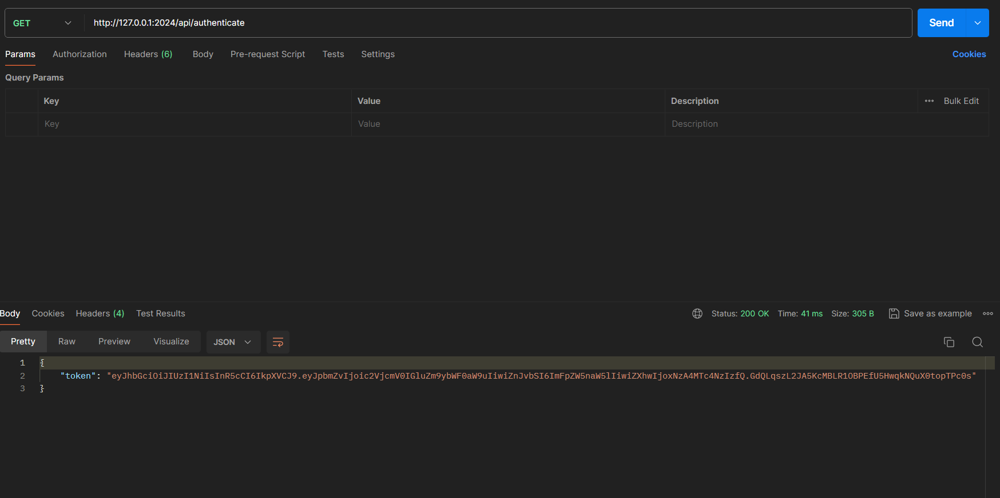
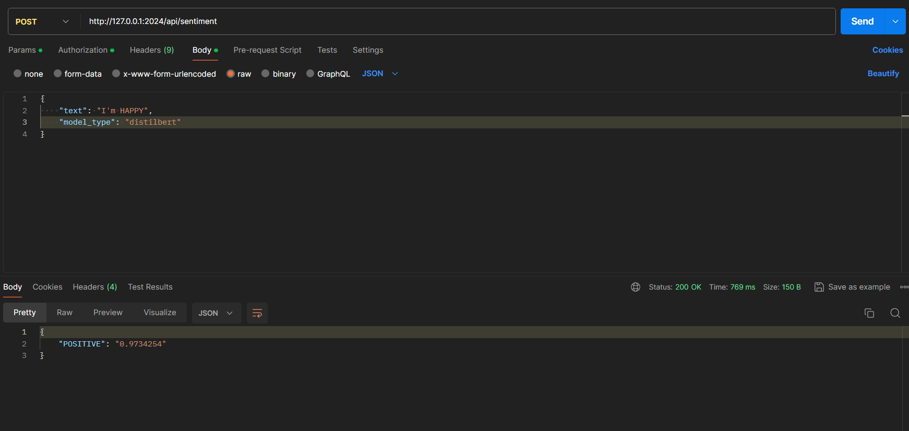

<h1 align="center">Welcome to sentiment analysis project 👋</h1>


> This project is about creating a script, api and app that detect sentiment from a text input .<br>
> I'm using the data from a public dataset IMDB<br>
> The notebook is worked on in google colab env for easy and cheap training<br>
> The app is developed using gradio for it's ease of use and versitilty when it comes to AI integration<br>
> The api is developed using FastAPI for it's native integration with AI oriented project, it's zippy performance, it's native integration of powerful authentifications like JWT and automatic verification of input and output data<br>
> The script is developed using python for it's native integrations of parseabale cli arguments and AI libraries<br>
> The pretrained model where downloaded from Huggingface a comunity driven hub for model weights and datasets, and it uses git as it's interface for ease of use<br>

## Install locally

```sh
conda create -n py38 python=3.8
```
then
```sh
conda activate py38
```
then
```sh
pip install -r requirements.txt
```

## Use API locally
```sh
conda activate py38
```
then
```sh
python sentiment.py
```
## use API with Docker

### build
```sh
docker build . -t sentiment
```
then
```sh
python sentiment.py
```

## Postman
### Auth
```sh
GET http://127.0.0.1:2024/api/authenticate
```


### Detect
```sh
POST http://127.0.0.1:2024/api/sentiment
```


> For docker usage use : "host.docker.internal" instead of "127.0.0.1" <br>


## Use APP
```sh
conda activate py38
```
then
```sh
python app.py
```

## Use Script
```sh
conda activate py38
```
then
```sh
python sentiment_script.py --model_type 'distilbert' --input_csv './data/IMDB-movie-reviews.csv' --output_csv './data/result.csv'
```

## Use Benchmark
```sh
conda activate py38
```
then
```sh
python benchmark.py --data_path ./data/IMDB-movie-reviews.csv
```


## Documentation

```sh
http://host.docker.internal:2024/docs
```


## Author

👤 **Ahmed Belarbi**


## Show your support

Give a ⭐️ for this project!

***
_This README was created with ❤️ by [Ahmed Belarbi]
